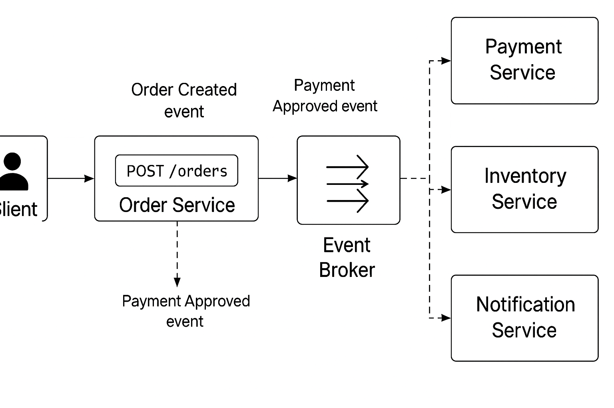

# eda-orders

1. a customer places an order
2. the system records this order and plblishes an event
3. other services listen to this event to perform actions

### services

- payment approves or rejects
- inventory reserves the items
- notification notifies the customer